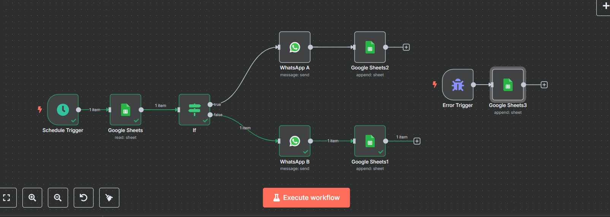

# 🎉 Automated Birthday Wishes Pipeline



---

## 📌 Overview

This project is an **n8n** automation pipeline that automatically sends personalized birthday wishes via WhatsApp to clients and logs each interaction in Google Sheets. It also records any errors that occur during execution.

---

## 🧩 How It Works

1. **Schedule Trigger**  
   - Runs daily at `03:30 AM` (cron: `0 30 3 * * *`).

2. **Read Google Sheet**  
   - Fetches clients whose birthday is today by matching the `dob(DD-MM)` column with the current date.


3. **Conditional Routing (`If` Node)**  
   - Checks the `client(A/B)` field.
   - If `A`, send wishes via **WhatsApp A**.
   - If `B`, send wishes via **WhatsApp B**.

4. **Send WhatsApp Message**  
   - Personalized message:  
     ```
     Happy Birthday {{ name }}
     ```

5. **Log the Message**  
   - Appends the sent message details to a **Logs Google Sheet**:
     - Name
     - Client A/B
     - Date and Time
     - Message ID


6. **Error Handling**  
   - If an error occurs, an **Error Trigger** logs:
     - Time
     - Workflow Name
     - Error Message
     - Last Node Executed

---

## 📂 Google Sheets Structure

### 🎂 Birthday List
- `name`
- `dob(DD-MM)`
- `client(A/B)`

### 📝 Logs
- `Date and Time`
- `Name`
- `Client A/B`
- `Message ID`

### ⚠️ Error Logs
- `Time`
- `Workflow`
- `Error Message`
- `Last Node Executed`

---
